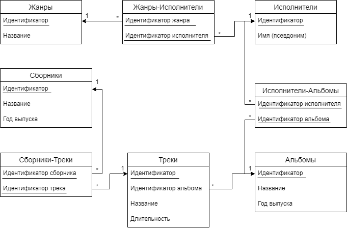

# Домашнее задание к лекции «Группировки, выборки из нескольких таблиц»

Написать SELECT-запросы, которые выведут информацию согласно инструкциям ниже.  
Внимание! Результаты запросов не должны быть пустыми (при необходимости добавьте данные в таблицы).

1. количество исполнителей в каждом жанре;
2. количество треков, вошедших в альбомы 2019-2020 годов;
3. средняя продолжительность треков по каждому альбому;
4. все исполнители, которые не выпустили альбомы в 2020 году;
5. названия сборников, в которых присутствует конкретный исполнитель (выберите сами);
6. название альбомов, в которых присутствуют исполнители более 1 жанра;
7. наименование треков, которые не входят в сборники;
8. исполнителя(-ей), написавшего самый короткий по продолжительности трек (теоретически таких треков может быть несколько);
9. название альбомов, содержащих наименьшее количество треков.

Результатом работы будет 3 файла (с INSERT, SELECT запросами и CREATE запросами из предыдущего задания) в формате .sql (или .py/.ipynb, если вы будете писать запросы с использованием SQLAlchemy).   
В случае если INSERT- и CREATE-запросы остались без изменений, приложите файлы c ними из предыдущих домашних заданий.